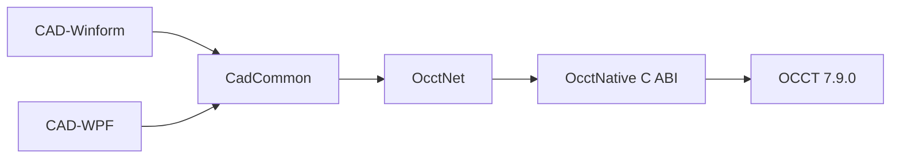

# OCCT 7.9.0 C# CAD Bridge

[中文](README.md)

This project wraps Open CASCADE Technology 7.9.0 through a **native C++ DLL, a stable C ABI, and C# P/Invoke**. It provides two compact CAD applications for WinForms and WPF. English is the default UI language; Simplified Chinese can be selected from the `Language` menu.

## Architecture



| Project | Purpose |
|---|---|
| `OcctNative` | OCCT geometry, topology, features, AIS, Viewer, annotations, and data exchange |
| `OcctNet` | Type-safe C# API, P/Invoke, object lifetime, and the WinForms viewport control |
| `CadCommon` | Shared commands, session, undo/redo, localization, and advanced samples |
| `CadWinForms` | WinForms CAD application using the standard `Form / Designer / resx` structure |
| `CadWpf` | WPF CAD application reusing the OCCT viewport through `WindowsFormsHost` |

## Avalonia status

The previous `CadAvalonia` project has been removed. The native viewer currently depends on a Windows `HWND` and OCCT `WNT_Window`. Avalonia `NativeControlHost` can host a platform-native control, but it does not turn that Windows viewer into a Linux or macOS implementation. The previous sample was therefore not a genuine cross-platform CAD application and had unstable startup/native-handle lifetime behavior.

A real cross-platform implementation requires separate Windows, X11/Wayland, and macOS native window adapters plus matching OCCT binaries for each platform.

## Fixed development environment

| Item | Path or version |
|---|---|
| OCCT root | `D:\tools\occt-vc144-64` |
| Headers | `D:\tools\occt-vc144-64\inc` |
| Libraries | `D:\tools\occt-vc144-64\win64\vc14\lib` |
| OCCT runtime | `D:\tools\occt-vc144-64\win64\vc14\bin` |
| Third-party runtime | `D:\tools\occt-vc144-64\3rdparty-vc14-64` |
| .NET | 8.0 Windows Desktop |
| CMake | 3.21 or later |
| Compiler | Visual Studio 2022 x64 |

Install the Visual Studio workloads **Desktop development with C++** and **.NET desktop development**.

## Build and run

Arguments are `target configuration`. The default configuration is `Release`.

```powershell
Set-ExecutionPolicy -Scope Process Bypass

.\build.ps1 native
.\build.ps1 winform
.\build.ps1 wpf
.\build.ps1 all

.\build.ps1 wpf Debug
.\build.ps1 all RelWithDebInfo
```

| Target | Result |
|---|---|
| `native` | Build only `OcctNative.dll` |
| `winform` | Build Native and WinForms |
| `wpf` | Build Native and WPF |
| `all` | Build Native, WinForms, and WPF |

Run:

```powershell
.\run.ps1 winform
.\run.ps1 wpf

.\run.ps1 winform Debug
```

`run.ps1` adds only the fixed OCCT runtime and the component `bin`, `bin\win64`, and `bin\x64` directories under `3rdparty-vc14-64` to the current process `PATH`. It does not scan unrelated FreeCAD, DBeaver, OSG, or other software directories.

## CAD shell

Both applications use the same conventional CAD layout:

```text
Menu bar
Toolbar
├─ Left: Model Explorer
├─ Center: OCCT Viewport + ViewCube
└─ Right: Properties / Command Line
Status bar: command state, selection state, and world coordinates
```

Top-level menus:

```text
File  Edit  Draw  Solid  Annotate  View  Tools  Samples  Language  Help
```

English is the default language. Selecting `Language > 简体中文` updates menus, toolbars, parameter dialogs, status messages, object properties, and command names.

## Interaction

| Input | Action |
|---|---|
| Left click | Select an object or subshape |
| Left drag | Rectangle/window selection |
| `Ctrl` + selection | Add to the selection set |
| Right drag | Orbit |
| Middle drag | Pan |
| Mouse wheel | Zoom |
| `Esc` | Deselect all |
| `Ctrl+Z` / `Ctrl+Y` | Undo / Redo |

Selection filters include Object, Vertex, Edge, Wire, Face, Shell, and Solid.

## Undo and redo

The current implementation uses **command replay**, not an OCAF parametric feature tree.

Tracked operations include:

- 2D, 3D, feature, and Boolean commands;
- move, rotate, scale, mirror, copy, and erase;
- 3D text and advanced samples;
- import operations;
- multi-step undo and redo, with redo truncation after a new command.

Boundaries:

- `Open` establishes a new history baseline. Replay reloads the original file, so that file must remain accessible;
- direct linear, angular, radius, and diameter dimensions based on temporary subshape selection clear and disable the current undo history; `New` or `Open` enables it again;
- view orientation, visual style, material, lighting, background, and selection preferences are not part of modeling history;
- this is a wrapper demonstration and is not a replacement for persistent OCAF/XDE feature history.

## API coverage

| Module | Main features |
|---|---|
| Core and queries | Points, vectors, bounding boxes, mass properties, centroid, distance, topology counts, validation |
| 2D | Point, line, polyline, circle, arc, ellipse, Bezier, B-spline, rectangle, polygon, planar face |
| 3D | Box, cylinder, frustum, cone, sphere, torus, wedge, tube, compound, wire, shell, solid |
| Features | Extrude, revolve, sweep, loft, fillet, chamfer, offset, shelling, drilling |
| Boolean | Union, subtract, intersect, section curves |
| AIS and view | Display, selection, highlighting, window selection, camera, standard views, ViewCube, projection, resolution, materials, lighting, background |
| Annotations | 3D text, linear, angular, radius, and diameter dimensions |
| IO | STEP, IGES, BREP, STL import/export and viewport capture |

## Exception logs

WinForms and WPF install global exception handlers. Logs are written to:

```text
%LOCALAPPDATA%\OcctCSharpBridge\Logs
```

## License

The project is provided under the [PolyForm Noncommercial License 1.0.0](LICENSE):

- personal study, research, testing, and other permitted noncommercial uses are allowed;
- modification and distribution are allowed under the license terms;
- commercial use is outside this license and requires a separate commercial license;
- this is a source-available noncommercial license, not an OSI open-source license.

OCCT and all third-party dependencies remain subject to their own licenses.

## Current limits

- STEP and IGES currently use plain `TopoDS_Shape` exchange and do not preserve full XDE assembly instances, names, colors, or layers;
- topology traversal indices are not persistent identifiers after Boolean or feature reconstruction;
- the current binaries, viewport, and build scripts target Windows x64 only.
