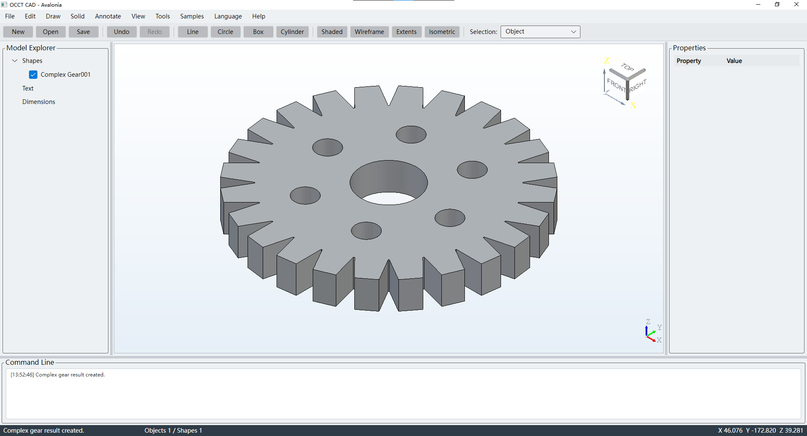

# OcctCSharpBridge Demo

[简体中文](README.zh-CN.md) · [Main SDK](https://github.com/zly258/OcctCSharpBridge/tree/main)

`demo` is the unified consumer branch for the Binary SDK produced by `main`. The current Windows phase contains one shared scenario layer and all three desktop UI hosts:

```text
OcctDemo.Common
├─ OcctDemo.WinForms  → OcctNet.WinForms
├─ OcctDemo.Wpf       → OcctNet.Wpf
└─ OcctDemo.Avalonia  → OcctNet.Avalonia
```

Windows x64 builds WinForms, WPF and Avalonia. Linux x64 will build Avalonia only; its shell build/run/publish workflow is the next phase after Windows validation and remains in this same `demo` branch rather than a standalone Avalonia branch.

The Demo is a strict Bridge 3 / ABI5 consumer. It does not track `OcctNative` or `OcctNet*` implementation sources and does not call the native `occt_*` ABI directly.

## Demo previews

### WinForms / Windows

[](assets/previews/winform-demo-en.png)

### WPF / Windows

[](assets/previews/wpf-demo-en.png)

### Avalonia / Windows

[](assets/previews/avalonia-win-demo-en.png)

Click a preview to open the original PNG.

## Binary SDK workflow

`dist/` is local build state and is intentionally ignored by Git. `sync.ps1` fetches `main`, validates the Bridge 3 / ABI5 contract and Binary SDK manifest, and reuses the local `dist/win-x64` SDK when its `sourceCommit` already matches `origin/main`.

```powershell
.\sync.ps1
```

Force a clean SDK rebuild only when required:

```powershell
.\sync.ps1 -ForceRebuild
```

You can also consume an already generated SDK explicitly:

```powershell
.\sync.ps1 -SdkRoot D:\sdk\OcctCSharpBridge\win-x64
```

## Windows build

```powershell
.\build.ps1 validate Release
.\build.ps1 common Release
.\build.ps1 winform Release
.\build.ps1 wpf Release
.\build.ps1 avalonia Release
.\build.ps1 all Release
```

The consumer check rejects SDK implementation sources, direct `OcctNative` ABI calls, pre-ABI5 handles/metadata and retired managed Bridge APIs before compilation.

## Windows run

```powershell
.\run.ps1 winform Release
.\run.ps1 wpf Release
.\run.ps1 avalonia Release
```

## Windows portable publish

```powershell
.\publish.ps1 winform Release -OcctRoot "D:\tools\occt-vc144-64"
.\publish.ps1 wpf Release -OcctRoot "D:\tools\occt-vc144-64"
.\publish.ps1 avalonia Release -OcctRoot "D:\tools\occt-vc144-64"
.\publish.ps1 all Release -OcctRoot "D:\tools\occt-vc144-64"
```

`all` produces three independent Windows packages; it does not combine the applications into one directory.

## Branch responsibilities

- `main`: sole formal Bridge SDK source (`OcctNative`, Core, WinForms, WPF and Avalonia adapters).
- `demo`: unified SDK consumer for Windows WinForms/WPF/Avalonia and, after the Windows validation phase, Linux Avalonia.
- `website`: bilingual project website.

The standalone Avalonia branches are migration sources only and are not part of the target branch architecture. They will be removed after their remaining Linux content is absorbed and validated.

The project uses GNU LGPL 2.1 + OcctCSharpBridge Exception 1.0; see the repository license files.