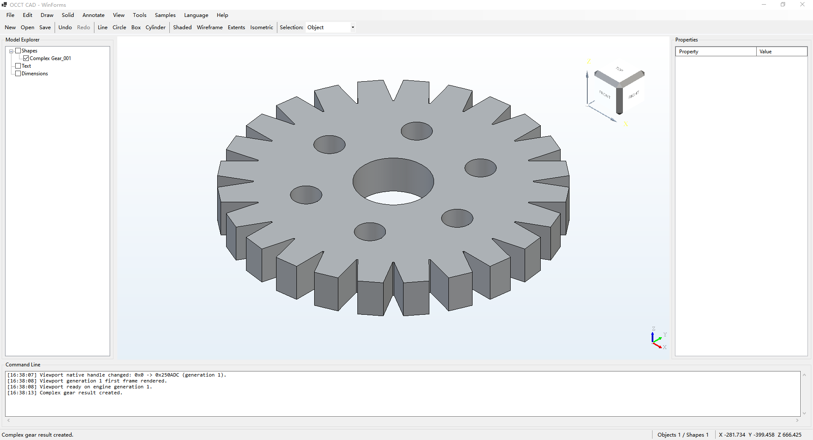
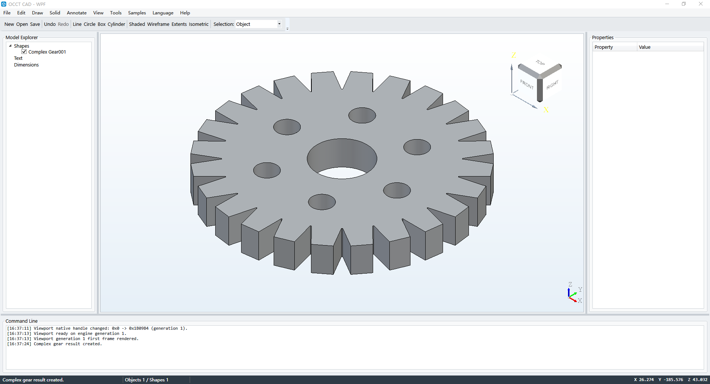

# OcctCSharpBridge Demo

[简体中文](README.zh-CN.md) · [Main](https://github.com/zly258/OcctCSharpBridge/tree/main) · [Cross-platform Avalonia](https://github.com/zly258/OcctCSharpBridge/tree/avalonia)

The `demo` branch contains the Windows demonstration applications for the published `main` Binary SDK. It keeps the shared demo scenarios plus the two Windows UI hosts:

```text
OcctDemo.Common
OcctDemo.WinForms
OcctDemo.Wpf
```

Avalonia is developed independently on the `avalonia` branch, where the same CAD-style scenarios are demonstrated on Windows and Linux.

## Demo previews

### WinForms

[](assets/previews/winform-demo-en.png)

### WPF

[](assets/previews/wpf-demo-en.png)

Click a preview to open the original PNG.

## SDK consumption

`demo/dist/win-x64` is local and ignored by Git. Synchronize the currently published Windows SDK from `main`:

```powershell
.\sync.ps1
```

The synchronized SDK must provide the Core, WinForms and WPF Bridge assemblies. No `OcctNet.Avalonia.dll` is required by this branch.

## Build

```powershell
.\build.ps1 validate Release
.\build.ps1 common Release
.\build.ps1 winform Release
.\build.ps1 wpf Release
.\build.ps1 all Release
```

## Run

```powershell
.\run.ps1 winform Release
.\run.ps1 wpf Release
```

## Publish portable demo applications

```powershell
.\publish.ps1 winform Release -OcctRoot "D:\tools\occt-vc144-64"
.\publish.ps1 wpf Release -OcctRoot "D:\tools\occt-vc144-64"
.\publish.ps1 all Release -OcctRoot "D:\tools\occt-vc144-64"
```

## Branch responsibilities

- `main`: Windows Bridge source + tracked Windows Binary SDK (`OcctNet`, WinForms, WPF).
- `demo`: Windows WinForms/WPF demonstration applications.
- `avalonia`: standalone `OcctNet + OcctNet.Avalonia` for Windows x64 + Linux x64, with its own Windows/Linux previews.
- `website`: bilingual project website presenting both demo families.

The project uses GNU LGPL 2.1 + OcctCSharpBridge Exception 1.0; see the repository license files.