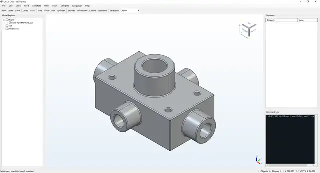
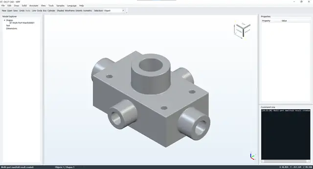

# OcctCSharpBridge Demo

[Main SDK branch](https://github.com/zly258/OcctCSharpBridge/tree/main) · [简体中文](README.zh-CN.md) · [API coverage](docs/API_COVERAGE.md)

The `demo` branch adds complete WinForms, WPF, and Avalonia CAD reference applications on top of the reusable bridge maintained with `main`. Shared native/.NET wrapper code and contract metadata are continuously compared with `main`; application UI, demo scenarios, run scripts, publishing, and package validation remain demo-only.

Bridge **2.6.0 / ABI 3** is a breaking API cleanup. The demos use the canonical names directly; no compatibility alias layer is kept. Raw shape/object IDs are resolved through their owning `OcctEngine`/`OcctModelingSession`, managed modeling options use `bool`/enums, and the headless API includes OBB, topology identity, planar faces with holes, exact edge trimming, planar wire offset, and whole-shape mesh access.

OCAF/XDE is intentionally not used as the application document layer. Documents, JSON persistence, command history, undo/redo, tools, and domain entities belong to the consuming application.

## Toolchain and contract

- Windows x64
- Open CASCADE Technology **7.9.0**, VC14 x64 layout
- .NET SDK **10.0.302** for this branch, pinned by `global.json`
- Target framework **`net8.0-windows`**
- C# 12.0
- CMake 3.21+
- Avalonia `12.1.0`
- Bridge version `2.6.0`, native ABI `3`

`bridge-contract.json` is shared with `main` and is authoritative for Bridge/ABI/OCCT/.NET/API metadata. `global.json` is intentionally branch-specific: `main` uses .NET SDK 8.0.423, while `demo` uses 10.0.302 for Avalonia 12 analyzers. Both still target .NET 8 and C# 12.

## Layering

- `OcctNet`: interactive `OcctEngine`, headless `OcctModelingSession`, geometry/topology/analysis/mesh/exchange/runtime APIs.
- `OcctNet.WinForms`: reusable native-HWND `OcctViewportControl`.
- `OcctNet.Wpf`: reusable `OcctWpfViewport`.
- `OcctNet.Avalonia`: Windows x64 Avalonia `NativeControlHost` with its own child HWND.
- `CadCommon`: shared application/session/command/document layer.
- `CadWinForms`, `CadWpf`, `CadAvalonia`: runnable reference applications.

Avalonia remains a native Windows HWND host; the project does not claim Linux/macOS OCCT Viewer support.

## Preview

<table>
  <tr><th>WinForms</th><th>WPF</th></tr>
  <tr>
    <td></td>
    <td></td>
  </tr>
</table>

Avalonia uses the same `CadSession` and `CadCommandCatalog` layer as WPF and exposes the same main CAD workflow: model creation, selection, model explorer, properties, undo/redo, file exchange, annotations, analysis, view/display controls, samples, shortcuts, and bilingual UI.

## First-time setup

```powershell
git clone https://github.com/zly258/OcctCSharpBridge.git
cd OcctCSharpBridge
git switch demo
$env:OCCT_ROOT = "D:\tools\occt-vc144-64"
```

Expected OCCT layout: `inc`, `win64\vc14\lib`, `win64\vc14\bin`, and optionally `3rdparty-vc14-64`.

## Build and validation

`build.ps1` is the single build entry point:

| Target | Purpose | OCCT SDK |
| --- | --- | --- |
| `validate` | Contract/source/package checks only | No |
| `managed` | Core wrapper + WinForms/WPF/Avalonia hosts + `CadCommon` | No |
| `ci` | Contract checks, managed regression tests, all 3 demos, Smoke compilation | No |
| `native` | Build `OcctNative.dll` | Yes |
| `winform` / `wpf` / `avalonia` | Build selected runnable demo | Yes |
| `smoke` | Build native bridge and run real OCCT modeling scenarios | Yes |
| `all` | Build native bridge, all demos, and Smoke project | Yes |

```powershell
.\build.ps1 validate Release
.\build.ps1 ci Release
.\build.ps1 all Release
.\build.ps1 smoke Release -OcctRoot "D:\tools\occt-vc144-64"
```

GitHub-hosted CI has no project OCCT SDK, so it runs managed/static contracts and compiles the Smoke project. Real OCCT Smoke execution is deliberately a local release gate.

## Run

`run.ps1` starts an already-built application; it does not silently rebuild it.

```powershell
.\run.ps1 winform
.\run.ps1 wpf
.\run.ps1 avalonia
```

## Publish

`publish.ps1` supports **WinForms, WPF, and Avalonia**; `all` publishes all three.

```powershell
.\publish.ps1 all Release -Zip -OcctRoot "D:\tools\occt-vc144-64"
.\publish.ps1 winform Release -Zip -OcctRoot "D:\tools\occt-vc144-64"
.\publish.ps1 wpf Release -Zip -OcctRoot "D:\tools\occt-vc144-64"
.\publish.ps1 avalonia Release -Zip -OcctRoot "D:\tools\occt-vc144-64"
```

The publisher resolves the PE dependency closure of `OcctNative.dll`, OCCT modules, third-party DLLs, and Visual C++ runtime components. Native DLLs are copied beside every executable rather than relying only on a sibling runtime directory. A static `dumpbin` closure check and fresh-process restricted `LoadLibraryExW` probe reject packages that would fail with clean-machine Win32 126.

Published packages include required OCCT resources, `package-contract.json`, `native-dependencies.txt`, and available license notices. Use `-FrameworkDependent` only when the target machine already has the .NET 8 Desktop Runtime.

## Tests

PowerShell checks protect static/API contracts. `OcctNet.ManagedTests` runs without OCCT and verifies ownership, managed value semantics, option DTO mapping, guards, and runtime configuration. `OcctNet.Smoke` is retained because it is the real Native integration suite.

Recommended cadence:

- `build.ps1 validate`: every API/source change.
- `build.ps1 ci`: before every push.
- `build.ps1 smoke`: after Native/modeling/runtime changes and before release.
- `publish.ps1 ...`: before redistribution.

## Main capabilities exercised by the demos

- Point, rectangle/directional crossing, multi-selection, and subshape selection
- Camera/view state, Z-up views, fitting, projection, ViewCube and triedron
- Shaded/wireframe/shaded-with-edges display and material/lighting/precision controls
- Stable application tags, transforms, visibility, color, transparency, batch operations
- Primitive/feature modeling, Boolean, sweep/loft, topology/geometry queries
- Analytic/differential geometry, mass properties, distance/ray/projection and mesh access
- BRep text and length/angle/radius/diameter annotations
- STEP, IGES, BREP, STL exchange
- English and Simplified Chinese UI

## Troubleshooting

- `OCCT_ROOT is not configured`: set `$env:OCCT_ROOT` or pass `-OcctRoot` to a Native target.
- `Unable to load OcctNative.dll ... Win32 126`: republish with current `publish.ps1`; each application directory must contain the matching ABI 3 Native dependency closure.
- Avalonia analyzer/compiler mismatch: use the branch-pinned SDK from `global.json`.
- Avalonia startup issue: inspect `src\CadAvalonia\bin\x64\<Configuration>\net8.0-windows\CAD-Avalonia.log`.

## License

The project uses the [PolyForm Noncommercial License 1.0.0](LICENSE). Open CASCADE Technology and third-party components remain subject to their own licenses.

## Contact

Liaoyuan Zhang · [zhangly1403@gmail.com](mailto:zhangly1403@gmail.com)
