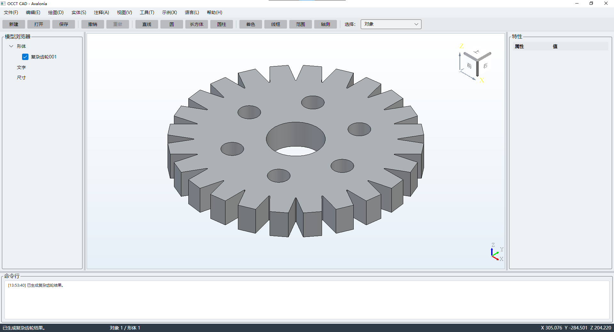

# OcctCSharpBridge Demo

[English](README.md) · [Main SDK](https://github.com/zly258/OcctCSharpBridge/tree/main)

`demo` 是 `main` Binary SDK 的统一 Consumer 分支。当前 Windows 阶段已经统一一套共享业务场景和三个桌面 UI Host：

```text
OcctDemo.Common
├─ OcctDemo.WinForms  → OcctNet.WinForms
├─ OcctDemo.Wpf       → OcctNet.Wpf
└─ OcctDemo.Avalonia  → OcctNet.Avalonia
```

Windows x64 构建 WinForms、WPF、Avalonia；Linux x64 最终只构建 Avalonia。Linux 的 shell 构建/运行/发布流程将在 Windows 验证完成后继续并入同一个 `demo` 分支，不再使用独立 Avalonia Demo 分支。

Demo 严格作为 Bridge 3 / ABI5 Consumer：不跟踪 `OcctNative`、`OcctNet*` SDK 实现源码，也不直接调用 `occt_*` Native ABI。

## Demo 运行预览

### WinForms / Windows

[](assets/previews/winform-demo-zh.png)

### WPF / Windows

[](assets/previews/wpf-demo-zh.png)

### Avalonia / Windows

[](assets/previews/avalonia-win-demo-zh.png)

点击图片可查看原始 PNG 大图。

## Binary SDK 同步

`dist/` 只作为本地构建状态存在并被 Git 忽略。`sync.ps1` 会获取 `main`、校验 Bridge 3 / ABI5 contract 与 Binary SDK manifest；如果本地 `dist/win-x64` 的 `sourceCommit` 已与 `origin/main` 一致，则直接复用，不重复编译 SDK。

```powershell
.\sync.ps1
```

仅在确实需要时强制重新生成 SDK：

```powershell
.\sync.ps1 -ForceRebuild
```

也可以显式消费已经生成好的 SDK：

```powershell
.\sync.ps1 -SdkRoot D:\sdk\OcctCSharpBridge\win-x64
```

## Windows 构建

```powershell
.\build.ps1 validate Release
.\build.ps1 common Release
.\build.ps1 winform Release
.\build.ps1 wpf Release
.\build.ps1 avalonia Release
.\build.ps1 all Release
```

Consumer 检查会在编译前禁止 SDK 实现源码、直接 `OcctNative` ABI 调用、pre-ABI5 Handle/metadata 以及已经退休的 Managed Bridge API。

## Windows 运行

```powershell
.\run.ps1 winform Release
.\run.ps1 wpf Release
.\run.ps1 avalonia Release
```

## Windows 独立发布包

```powershell
.\publish.ps1 winform Release -OcctRoot "D:\tools\occt-vc144-64"
.\publish.ps1 wpf Release -OcctRoot "D:\tools\occt-vc144-64"
.\publish.ps1 avalonia Release -OcctRoot "D:\tools\occt-vc144-64"
.\publish.ps1 all Release -OcctRoot "D:\tools\occt-vc144-64"
```

`all` 会生成三个彼此独立的 Windows 发布包，不会把三个应用混合到同一目录。

## 分支职责

- `main`：唯一正式 Bridge SDK 源（`OcctNative`、Core、WinForms、WPF、Avalonia Adapter）。
- `demo`：统一 SDK Consumer；Windows 提供 WinForms/WPF/Avalonia，Windows 验证完成后继续承载 Linux Avalonia。
- `website`：统一中英文官网。

原 `avalonia` / `avalonia-dev` 仅作为迁移来源保留；待剩余 Linux 内容全部并入并验证后删除，不再作为目标分支架构的一部分。

许可证为 GNU LGPL 2.1 + OcctCSharpBridge Exception 1.0。