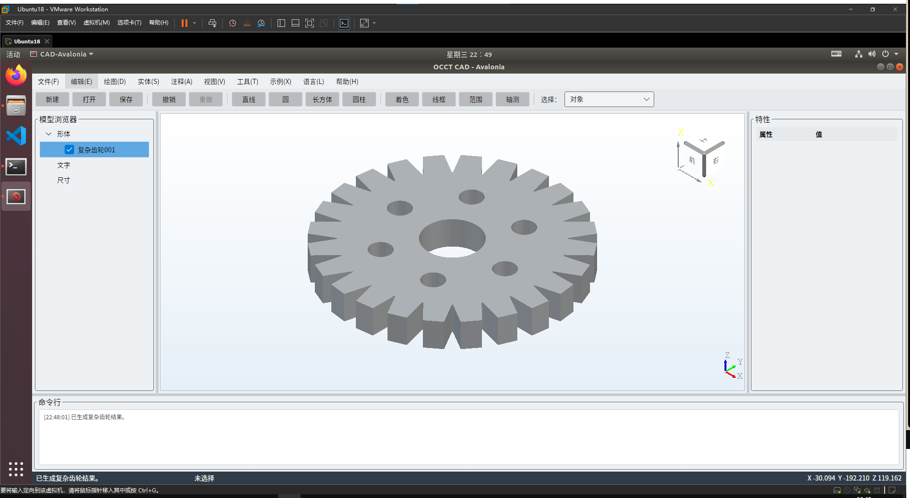

# OcctCSharpBridge

[English](README.md) · [中文文档](docs/zh-CN/README.md) · [English Docs](docs/en-US/README.md) · [第三方 SDK 接入](docs/zh-CN/09_第三方项目消费SDK.md) · [Stable 支持策略](docs/zh-CN/10_稳定版支持与兼容策略.md) · [统一 Demo](https://github.com/zly258/OcctCSharpBridge/tree/demo)

OcctCSharpBridge 3.0 是面向 CAD/BIM/工程应用的 **Open CASCADE Technology 7.9.0 → .NET** Bridge。源码同时维护 Windows x64 与 Linux x64；**官方 3.x 预编译 SDK 只发布 Windows x64**，Linux 保留源码构建与 Avalonia 运行支持。

Bridge 3 **仅支持 Native ABI 5**。ABI 4 导出、兼容 Shim、旧 Handle 与旧 Binary SDK Payload 不属于 3.x 稳定契约。

## 3.0 Stable 契约

| 项目 | 契约 |
| --- | --- |
| Bridge | **3.0.0** |
| Native ABI | **ABI 5 only** |
| OCCT | **7.9.0 exact** |
| 构建 SDK | **稳定版 .NET 10 SDK，基线 `10.0.100`，`latestFeature`** |
| 默认回归/Smoke Runtime | **.NET 10** |
| Managed Binary 兼容 TFM | Core/Avalonia `net8.0`；WinForms/WPF `net8.0-windows` |
| Consumer | **.NET 8 / 9 / 10** |
| Windows UI | WinForms / WPF / Avalonia |
| Linux UI | Avalonia（源码构建） |
| 官方预编译发布 | **Windows x64** |
| 源码构建支持 | Windows x64 / Linux x64 |
| Native / C# | C++17 / C# 14 |

`bridge-contract.json` 是机器可读事实源。**日常开发、Managed Regression Test、Core Smoke 和 Windows 三套 UI Smoke 默认运行在 .NET 10。** 发布的 Managed DLL 继续使用 .NET 8 TFM 作为最低兼容基线，因此同一份扁平 Binary SDK 可以被 .NET 8、9、10 Consumer 使用；Stable 发布 Gate 会再分别在真实 .NET 8、9、10 Runtime 上执行 Native Smoke。

## 平台与分发

### Windows x64 — 正式预编译支持

正式 Release 提供 Windows Portable SDK。它包含：

```text
OcctNet.dll
OcctNet.WinForms.dll
OcctNet.Wpf.dll
OcctNet.Avalonia.dll
bridge-contract.json
bridge-manifest.json
package-manifest.json
runtime/
  OcctNative.dll
  OCCT / required native closure
occt/resources/
licenses / notices
```

应用应整体部署同一份 SDK Build 的 Managed DLL、`runtime/`、`occt/` 与 Manifest，不要混用不同版本或不同 `sourceCommit` 的文件。

### Linux x64 — 源码支持

Linux 源码、Core、Avalonia Adapter、测试和构建脚本继续维护：

```bash
./build.sh validate Release
./build.sh all Release
./build.sh avalonia-smoke Release   # 需要有效 DISPLAY
```

3.x 官方 Release **不提供 Linux 预编译 Binary/Portable Asset**。Linux 使用者应在目标发行版兼容的 OCCT 7.9.0 / C++ Runtime 环境中从源码构建，避免跨发行版 glibc/libstdc++ ABI 假设。

## SDK 生产分层

### Consumer 快路径

Demo、内部项目或第三方源码构建只需要刷新 SDK 时使用：

```powershell
.\build.ps1 dist Release -OcctRoot "D:\tools\occt-vc144-64"
```

Linux 源码 Consumer：

```bash
./build.sh dist Release
```

`dist` 只做必要 Contract Check、Native + Managed 编译和 Manifest/Hash 生成，**不运行** ManagedTests、Consumer Matrix、Core Smoke 或窗口 Smoke。

### Bridge 完整 Windows Gate

普通本地完整验证：

```powershell
.\build.ps1 all Release -OcctRoot "D:\tools\occt-vc144-64"
```

正式 Stable 发布统一使用一个入口：

```powershell
.\publish.ps1 `
  -OcctRoot "D:\tools\occt-vc144-64" `
  -Zip
```

Stable Contract 下，`publish.ps1` 包含：

1. Windows `/W4 /WX` Native Release 构建；
2. Managed warnings-as-errors；
3. **默认 .NET 10** 的 ManagedTests、Core Smoke、WinForms/WPF/Avalonia Smoke；
4. .NET 8/9/10 Consumer 编译矩阵；
5. Windows Binary SDK + Portable SDK + ZIP；
6. 实际 .NET 8、9、10 Runtime Native Smoke；
7. 解压 Portable ZIP、移除开发机 OCCT 环境后的隔离 Smoke；
8. Stable Managed API / Native ABI 基线兼容检查。

Stable Gate 要求机器实际安装 Microsoft.NETCore.App 8.x、9.x、10.x x64 Runtime；缺少任一版本会失败，而不是通过 Major Roll-forward 假装覆盖。

## 第三方最小使用

```csharp
using OcctNet;

OcctRuntime.Configure();

using var model = new OcctModelingSession();
var plate = model.MakeBox(100, 80, 10);
var hole = model.MakeCylinder(new OcctPoint3d(50, 40, -5), OcctVector3d.UnitZ, 8, 20);
var cut = model.Cut(plate, hole);
model.ExportStep(cut.Shape, "plate.step");
```

采用 Portable SDK 布局时，在第一次创建 `OcctEngine` 或 `OcctModelingSession` 前调用 `OcctRuntime.Configure()`。

完整 MSBuild 引用、部署、版本校验与升级说明见：[第三方项目消费 SDK](docs/zh-CN/09_第三方项目消费SDK.md)。

## 稳定版兼容边界

- `OcctEngine`、`OcctModelingSession` 及其拥有的 Native 对象默认**不是并发线程安全对象**；同一实例的调用应串行化。
- WinForms/WPF/Avalonia Viewer Host 必须遵守对应 UI Framework 的 UI Thread 生命周期规则。
- Modeling 数值默认按应用统一单位解释；Bridge 不在普通建模 API 中隐式切换项目单位。
- Handle/ID 与 Owner 绑定，不得跨 Engine/ModelingSession 混用。
- 3.x 不删除或破坏已发布 Managed Public API；ABI 5 已有入口和 ABI Layout 不做破坏性修改。破坏性变更需要新的 Major/ABI 策略。

详细规则见：[稳定版支持与兼容策略](docs/zh-CN/10_稳定版支持与兼容策略.md)。

## Demo 预览

统一 [demo](https://github.com/zly258/OcctCSharpBridge/tree/demo) 分支提供 Windows 上的 WinForms、WPF、Avalonia 参考 Host，以及 Linux 上的 Avalonia Host。规范全分辨率截图存放于 `assets/previews/`。

| Host | 截图 |
| --- | --- |
| WinForms (Windows) |  |
| WPF (Windows) |  |
| Avalonia (Windows) |  |
| Avalonia (Linux) |  |

生成的 `dist/`、`artifacts/`、Portable SDK 和发布压缩包不提交到源码分支。
