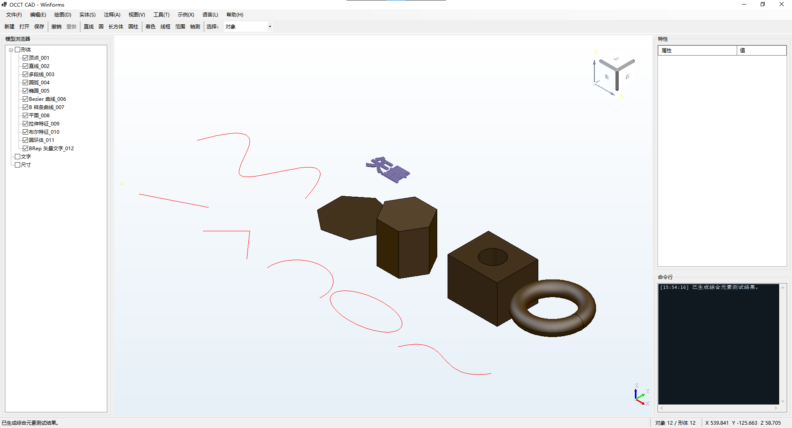
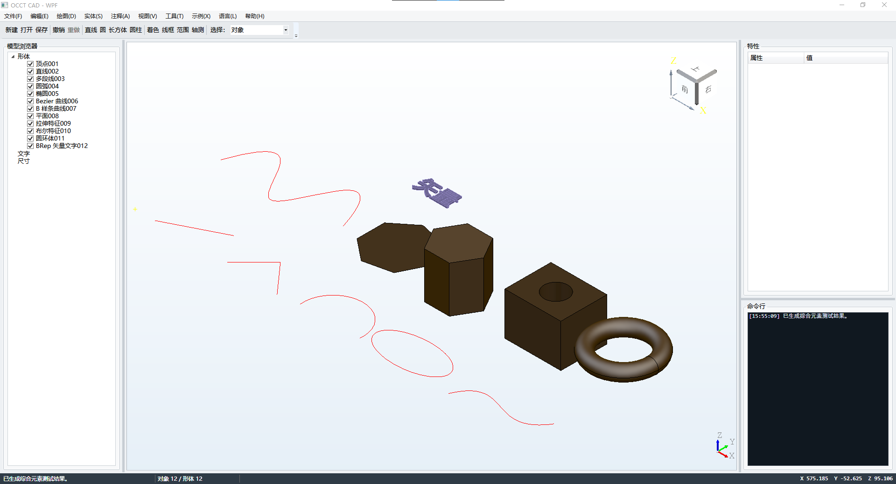
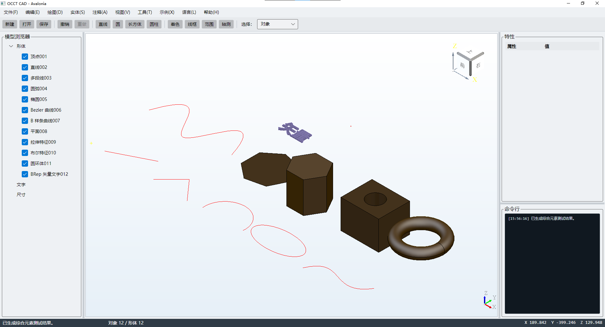

# OcctCSharpBridge Demo

[English](README.md) · [中文 API 覆盖说明](docs/API_COVERAGE.zh-CN.md) · [主 SDK 分支](https://github.com/zly258/OcctCSharpBridge/tree/main)

`demo` 分支在与 `main` 同步维护的 Bridge 之上提供完整 WinForms、WPF、Avalonia CAD 示例应用。Native/.NET 公共封装源码与契约持续和 `main` 比较；应用 UI、Demo 场景、运行/发布脚本和应用发布校核只保留在本分支。

**Bridge 2.6.0 / ABI 3** 是破坏性 API 收口版本。Demo 已直接使用规范接口，不保留兼容 Alias。Shape/Object 必须绑定所属 `OcctEngine` / `OcctModelingSession`，公开建模参数使用 `bool`/枚举；Headless API 包含 OBB、拓扑身份、带孔平面、Edge 精确裁剪、Wire Offset 和整 Shape Mesh。

桥接层不使用 OCAF/XDE。Document、Entity、Command、Undo/Redo、JSON 持久化和 Tool 等应用职责由上层程序实现。

## 工具链与契约

- Windows x64
- Open CASCADE Technology **7.9.0**，VC14 x64 目录结构
- 本分支 .NET SDK **10.0.302**，由 `global.json` 固定
- 目标框架 **`net8.0-windows`**
- C# 12.0
- CMake 3.21+
- Avalonia `12.1.0`
- Bridge `2.6.0`，Native ABI `3`

`bridge-contract.json` 与 `main` 共享，是版本、ABI、OCCT、.NET 和 API 数量的唯一契约来源。`global.json` 按分支设置：`main` 使用 8.0.423，`demo` 使用 10.0.302 以满足 Avalonia 12 Analyzer；两边仍统一目标为 .NET 8 / C# 12。

**NuGet SDK 打包只属于 `main` 分支。** `demo` 中三个可复用项目明确设置 `IsPackable=false`；本分支负责的是可运行桌面应用以及 app-local Native 依赖闭包发布，不承担 NuGet SDK 发布。

## 分层

- `OcctNet`：交互式 `OcctEngine`、Headless `OcctModelingSession`、几何/拓扑/分析/网格/文件交换/运行时。
- `OcctNet.WinForms`：可复用 `OcctViewportControl`。
- `OcctNet.Wpf`：可复用 `OcctWpfViewport`。
- `OcctNet.Avalonia`：Windows x64 `NativeControlHost` + 子 HWND。
- `CadCommon`：三个 Demo 共用的 Document/Session/Command 应用层。
- `CadWinForms`、`CadWpf`、`CadAvalonia`：可直接运行的参考应用。

当前 Avalonia Viewer 仍基于 Windows HWND，不声明 Linux/macOS OCCT Viewer 支持。

## Demo 界面代码组织

三个示例已经统一从原来的 50～60 KB 单窗口大文件拆分为按职责组织的 partial 文件：

```text
WinForms
├─ MainForm.cs                 状态、构造、事件连接
├─ MainForm.Designer.cs        WinForms 布局
├─ MainForm.Layout.cs          Splitter/启动布局策略
├─ MainForm.Menus.cs           菜单与工具栏
├─ MainForm.Commands.cs        UI 命令动作
├─ MainForm.Objects.cs         模型树与属性
└─ MainForm.Localization.cs    中英文界面

WPF
├─ MainWindow.xaml             布局与样式
├─ MainWindow.xaml.cs          状态、构造、事件连接
├─ MainWindow.xaml.Menus.cs
├─ MainWindow.xaml.Commands.cs
├─ MainWindow.xaml.Objects.cs
└─ MainWindow.xaml.Localization.cs

Avalonia
├─ MainWindow.cs               状态、构造、事件连接
├─ MainWindow.Layout.cs        程序化布局
├─ MainWindow.Menus.cs
├─ MainWindow.Commands.cs
├─ MainWindow.Objects.cs
└─ MainWindow.Localization.cs
```

三套 Demo 的工作区现在统一为：**左侧模型树 + 中间视口 + 右侧属性 + 底部横跨全宽的命令日志**。日志统一使用白色/浅色背景和深色文字，不再采用黑色 Console 风格背景。

这次调整以“方法体按职责移动”为主，没有删除 Command ID、选择行为、Document/Session 逻辑、建模能力、快捷键、文件交换、Undo/Redo 或 Viewer 功能。`tests/check-demo-ui-structure.ps1` 会限制主窗口重新膨胀，并持续校验底部浅色日志布局。

## 界面预览

<table>
  <tr><th>WinForms</th><th>WPF</th><th>Avalonia</th></tr>
  <tr>
    <td></td>
    <td></td>
    <td></td>
  </tr>
</table>

三套预览统一引用 `assets/previews/` 下正式保留的无损 PNG 文件，不再引用已淘汰的 WebP 文件名。

Avalonia 与 WPF 共用 `CadSession` 和 `CadCommandCatalog`，覆盖模型创建、选择、模型树、属性、撤销重做、文件交换、标注、分析、视图/显示控制、示例、快捷键和中英文 UI。

## 首次配置

```powershell
git clone https://github.com/zly258/OcctCSharpBridge.git
cd OcctCSharpBridge
git switch demo
$env:OCCT_ROOT = "D:\tools\occt-vc144-64"
```

OCCT 目录应包含 `inc`、`win64\vc14\lib`、`win64\vc14\bin`，以及可选 `3rdparty-vc14-64`。

## 构建与校验

`build.ps1` 是统一入口：

| Target | 作用 | OCCT SDK |
| --- | --- | --- |
| `validate` | 契约、源码、UI 结构和发布规则校验 | 否 |
| `managed` | Core + WinForms/WPF/Avalonia Host + `CadCommon` | 否 |
| `ci` | 契约检查 + Managed Test + 三个 Demo + Smoke 编译 | 否 |
| `native` | 构建 `OcctNative.dll` | 是 |
| `winform` / `wpf` / `avalonia` | 构建指定 Demo | 是 |
| `smoke` | 构建并真实执行 OCCT Native 场景 | 是 |
| `all` | 构建 Native、三个 Demo 和 Smoke | 是 |

```powershell
.\build.ps1 validate Release
.\build.ps1 ci Release
.\build.ps1 all Release
.\build.ps1 smoke Release -OcctRoot "D:\tools\occt-vc144-64"
```

GitHub 托管环境没有项目 OCCT SDK，因此只执行完整 Managed/静态契约并编译 Smoke；真实 Native Smoke 明确作为本地发布门禁。

## 运行

```powershell
.\run.ps1 winform
.\run.ps1 wpf
.\run.ps1 avalonia
```

`run.ps1` 只启动已构建程序，不隐式重新编译。

## 发布

`publish.ps1` 正式支持 WinForms、WPF、Avalonia：

```powershell
.\publish.ps1 all Release -Zip -OcctRoot "D:\tools\occt-vc144-64"
.\publish.ps1 winform Release -Zip -OcctRoot "D:\tools\occt-vc144-64"
.\publish.ps1 wpf Release -Zip -OcctRoot "D:\tools\occt-vc144-64"
.\publish.ps1 avalonia Release -Zip -OcctRoot "D:\tools\occt-vc144-64"
```

发布器递归解析 `OcctNative.dll`、OCCT TK、第三方库和 VC++ Runtime 的 PE 依赖闭包，并将 Native DLL 复制到每个 EXE 同目录。生成包前先执行 `dumpbin` 闭包检查，再在独立进程中用受限搜索路径实际 `LoadLibraryExW`；会产生 Win32 126 的包会在发布阶段直接失败。

发布包还包含 OCCT Resources、`package-contract.json`、`native-dependencies.txt` 和可获取的许可证信息。

## 测试

PowerShell 负责 API/静态/UI 契约；`OcctNet.ManagedTests` 无需 OCCT，检查 Owner、值类型、强类型 Options、Guard 和 Runtime 配置；`OcctNet.Smoke` 负责真实 Native 集成。

建议：

- API/源码/UI 改动后：`build.ps1 validate`
- 提交前：`build.ps1 ci`
- Native/建模/Runtime 改动后：`build.ps1 smoke`
- 对外发布前：`publish.ps1 ...`

## Demo 覆盖能力

- 点选、框选、方向框选、多选、子形选择
- 相机/视图、Z-up、Fit、坐标转换、ViewCube、Triedron
- Shaded/Wireframe/Shaded with Edges、材质、光照、精度
- ApplicationTag、变换、可见性、颜色、透明度、批量操作
- 基础体、特征、Boolean、Sweep/Loft、拓扑/几何查询
- 解析/微分几何、质量属性、距离/射线/投影、Mesh
- BRep 文字与长度/角度/半径/直径标注
- STEP、IGES、BREP、STL 交换
- 中英文桌面 UI

## 常见问题

- `OCCT_ROOT is not configured`：设置 `$env:OCCT_ROOT` 或给 Native target 传 `-OcctRoot`。
- `Unable to load OcctNative.dll ... Win32 126`：使用当前 `publish.ps1` 重新发布，确保 EXE 同目录具有匹配 ABI 3 的 Native 依赖闭包。
- Avalonia Analyzer/编译器不匹配：使用本分支 `global.json` 固定 SDK。
- Avalonia 启动异常：查看 `src\CadAvalonia\bin\x64\<Configuration>\net8.0-windows\CAD-Avalonia.log`。

## 许可证

项目使用 [PolyForm Noncommercial License 1.0.0](LICENSE)。OCCT 与第三方组件遵循各自许可证。

## 联系方式

Liaoyuan Zhang · [zhangly1403@gmail.com](mailto:zhangly1403@gmail.com)