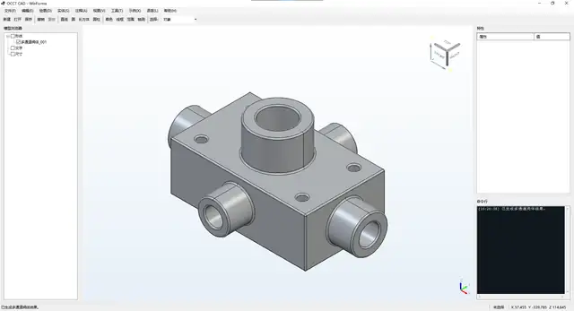
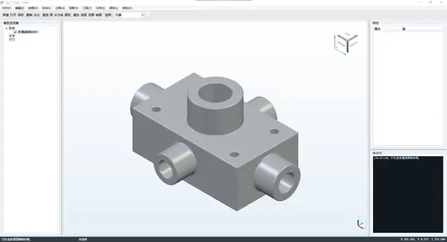

# OcctCSharpBridge Demo

[English](README.md) · [中文接口清单与使用说明](docs/API_COVERAGE.zh-CN.md) · [主 SDK 分支](https://github.com/zly258/OcctCSharpBridge/tree/main)

`demo` 分支在可复用 OCCT C# 封装基础上提供 WinForms、WPF、Avalonia 示例应用。`src/OcctNative`、`src/OcctNet` 以及可复用界面宿主与 `main` 保持相同的分层原则；应用界面、测试场景、运行脚本、发布工具和发布包校核仅保留在本分支。

托管封装分为：

- `OcctNet`：不依赖界面的 Viewer、建模、拓扑、解析几何、微分几何、分析、修复、网格和文件交换接口。
- `OcctNet.WinForms`：直接绑定 Win32 HWND 的 `OcctViewportControl`。
- `OcctNet.Wpf`：专用 `OcctWpfViewport`，统一处理 WPF 依赖属性、事件转发、DPI 同步和原生视口尺寸更新。
- `OcctNet.Avalonia`：基于 `NativeControlHost` 的独立 Avalonia 宿主。当前实现面向 Windows x64，由宿主创建子 HWND 并直接交给 `OcctEngine`；鼠标交互由子窗口 WndProc 处理，DPI 使用 `GetDpiForWindow` 同步，不依赖 WinForms/WPF 中转。

`OcctModelingSession` 已按职责拆分为生命周期、形状查询、拓扑、几何查询、解析几何、微分几何、构造、算法、分析、网格、文件交换和操作历史。规范接口名称明确表达操作对象和参数含义；旧的含义不够清晰的方法继续作为兼容别名保留。

桥接层不包含 OCAF/XDE。文档、JSON 持久化、撤销重做和命令历史由上层应用自行实现。

## 界面预览

<table>
  <tr>
    <th>WinForms · 简体中文</th>
    <th>WPF · 简体中文</th>
  </tr>
  <tr>
    <td></td>
    <td></td>
  </tr>
</table>

Avalonia 当前提供轻量的宿主验证 Demo，用于验证真实 OCCT 场景、点选/框选、旋转、平移、缩放、Z-up 视图、DPI 与原生窗口生命周期。完整 CAD 命令界面仍以 WinForms/WPF Demo 为主。

## 主要能力

- 独立的 WinForms、WPF、Avalonia OCCT 视口宿主
- 点选、框选、方向框选、多选和子形选择
- Avalonia 原生子 HWND 输入处理、DPI 同步和严格的 OCCT/窗口释放顺序
- 视口状态快照、相机保存恢复、Z-up 视图、适配选择集和屏幕投影到工作平面
- 批量颜色、透明度、可见性、显示模式、线宽、材质、重显示和选择
- 直线、圆、椭圆、平面、圆柱、圆锥、球面和圆环面的精确参数读取
- 边的原始参数范围、一阶/二阶导数、切向、法向、曲率和曲率中心
- 曲面的周期性、一阶/二阶偏导、按面方向修正的法向、主曲率、平均曲率、高斯曲率、主方向和脐点状态
- 选中及悬浮高亮颜色设置
- 纯色、渐变背景、MSAA、渲染分辨率、阴影、光线追踪和多灯光预设
- 二维曲线、基本实体、布尔、特征、变换、拓扑查询、网格读取及分析
- 复杂齿轮、多通道阀体、扭转风管等测试场景
- BRep 矢量文字及线性、角度、半径、直径注释
- STEP、IGES、BREP、STL 导入导出
- 中英文界面

复杂场景执行时使用显示批处理，并在结束后删除截面、刀具体、路径和辅助几何，只保留最终结果。

## Avalonia 宿主说明

当前 OCCT 原生 Viewer 使用 Windows `WNT_Window`，因此 `OcctNet.Avalonia` 当前明确限定为 **Windows x64 / HWND**。虽然 Avalonia 本身支持多平台，但本项目尚未实现 Linux `Xw_Window` 或 macOS 原生窗口桥接，不将当前实现声明为跨平台 OCCT Viewer。

`NativeControlHost` 内的 OCCT 视口属于独立原生合成层，因此存在典型空域限制：Avalonia 的普通半透明控件不应覆盖在 OCCT 原生视口上。框选矩形继续由 OCCT `AIS_RubberBand` 在原生视口内部绘制。

生命周期顺序固定为：取消交互和捕获 → 释放 `OcctEngine`/OCCT Viewer → 恢复子 HWND WndProc → 销毁子 HWND。避免先销毁窗口后释放 OCCT 图形上下文。

## 兼容性

- OCCT：必须为 `7.9.0`
- .NET：`8.0`，Windows x64
- Avalonia：`12.1.0`
- Bridge 版本：`2.5.0`
- Bridge ABI：`2`
- 接口数量：Native `339`，P/Invoke `339`
- Viewer 与交互接口：`221`
- 建模接口：`118`
- 公开核心 .NET 类型：`80`
- `OcctNet.dll`、选用的界面宿主程序集与 `OcctNative.dll` 必须来自同一次构建
- 原生会话包含可变状态，同一会话应由单一应用线程调用

## 构建与运行

可先设置 OCCT SDK 环境变量，也可以在命令中显式传入：

```powershell
$env:OCCT_ROOT = "D:\tools\occt-vc144-64"
.\build.ps1 all Release
.\run.ps1 winform
.\run.ps1 wpf
.\run.ps1 avalonia
```

只构建并运行 Avalonia Demo：

```powershell
.\build.ps1 avalonia Release -OcctRoot "D:\tools\occt-vc144-64"
.\run.ps1 avalonia Release -OcctRoot "D:\tools\occt-vc144-64"
```

不安装 OCCT SDK 也可以执行托管构建与静态检查：

```powershell
.\build.ps1 managed Release
```

校核内容包括 Bridge 版本、接口分类、解析几何、微分几何、原生声明与实现、Cdecl 与精确符号名称、选择逻辑、WinForms/WPF/Avalonia 视口宿主、原生源文件边界和完整发布包规则。

原生编译和运行时 Smoke 测试：

```powershell
.\build.ps1 smoke Release -OcctRoot "D:\tools\occt-vc144-64"
```

## 发布

现有 `publish.ps1` 继续负责 WinForms 和 WPF 的部署完整发布包。Avalonia 当前作为宿主验证 Demo 纳入构建、运行和 CI，但尚未加入正式发布包流程。

默认命令同时发布 WinForms 和 WPF，并生成 Windows x64 自包含程序；目标电脑不需要另外安装 .NET。

发布包按可直接部署设计：两个可执行程序分别内嵌 .NET 运行时，`runtime` 包含 `OcctNative.dll` 以及递归解析得到的 OCCT、第三方库和 Visual C++ DLL 依赖闭包，`occt/src` 包含必须的 OCCT 资源。缺少任何必需原生依赖或 OCCT 资源时发布会直接失败；`package-contract.json` 与 `native-dependencies.txt` 用于说明和校核包内容。

```powershell
.\publish.ps1 -Zip -OcctRoot "D:\tools\occt-vc144-64"
```

只发布其中一个程序：

```powershell
.\publish.ps1 winform Release -Zip -OcctRoot "D:\tools\occt-vc144-64"
.\publish.ps1 wpf Release -Zip -OcctRoot "D:\tools\occt-vc144-64"
```

只有目标电脑已经安装 .NET 8 Desktop Runtime 时，才使用体积较小的框架依赖模式：

```powershell
.\publish.ps1 all Release -FrameworkDependent -Zip -OcctRoot "D:\tools\occt-vc144-64"
```

`dotnet publish` 会通过项目引用包含对应的 `OcctNet` 和界面宿主程序集；`publish.ps1` 再补充完整原生依赖闭包及必需 OCCT 资源。`-FullResources`、`-Diagnostics` 仅在需要时开启。
