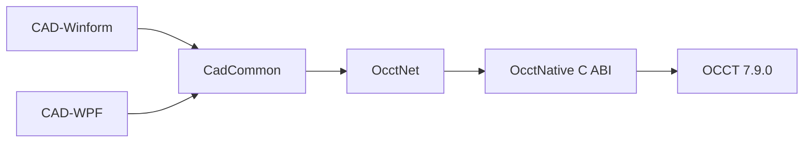

# OCCT 7.9.0 C# CAD 封装

[English](README.md)

本项目通过 **C++ 原生 DLL + 稳定 C ABI + C# P/Invoke** 封装 Open CASCADE Technology 7.9.0，提供 WinForms 和 WPF 两个简易 CAD 应用。界面默认英文，可在 `Language` 菜单切换为简体中文。

## 项目结构



| 项目 | 说明 |
|---|---|
| `OcctNative` | OCCT 几何、拓扑、特征、AIS、Viewer、注释与文件交换 |
| `OcctNet` | C# 类型安全 API、P/Invoke、对象生命周期和 WinForms 视口控件 |
| `CadCommon` | 公共命令、会话、撤销重做、国际化和复杂示例 |
| `CadWinForms` | WinForms CAD 应用，使用 `Form / Designer / resx` 传统结构 |
| `CadWpf` | WPF CAD 应用，通过 `WindowsFormsHost` 复用 OCCT 视口 |

## 固定开发环境

| 项目 | 路径或版本 |
|---|---|
| OCCT 根目录 | `D:\tools\occt-vc144-64` |
| 头文件 | `D:\tools\occt-vc144-64\inc` |
| 库文件 | `D:\tools\occt-vc144-64\win64\vc14\lib` |
| OCCT 运行库 | `D:\tools\occt-vc144-64\win64\vc14\bin` |
| 第三方运行库 | `D:\tools\occt-vc144-64\3rdparty-vc14-64` |
| .NET | 8.0 Windows Desktop |
| CMake | 3.21 或更高版本 |
| 编译器 | Visual Studio 2022 x64 |

Visual Studio 需安装“使用 C++ 的桌面开发”和“.NET 桌面开发”。

## 构建与运行

参数顺序为 `目标 配置`，配置默认为 `Release`。

```powershell
Set-ExecutionPolicy -Scope Process Bypass

.\build.ps1 native
.\build.ps1 winform
.\build.ps1 wpf
.\build.ps1 all

.\build.ps1 wpf Debug
.\build.ps1 all RelWithDebInfo
```

| 目标 | 构建内容 |
|---|---|
| `native` | 仅构建 `OcctNative.dll` |
| `winform` | 构建 Native 和 WinForms |
| `wpf` | 构建 Native 和 WPF |
| `all` | 构建 Native、WinForms 和 WPF |

运行：

```powershell
.\run.ps1 winform
.\run.ps1 wpf

.\run.ps1 winform Debug
```

`run.ps1` 仅将固定 OCCT 目录及 `3rdparty-vc14-64` 下组件的 `bin`、`bin\win64`、`bin\x64` 加入当前进程 `PATH`，不会扫描 FreeCAD、DBeaver、OSG 等其他软件目录。

## CAD 界面

两个应用采用统一的传统 CAD 布局：

```text
菜单栏
工具栏
├─ 左侧：Model Explorer
├─ 中间：OCCT Viewport + ViewCube
└─ 右侧：Properties / Command Line
状态栏：命令状态、选择状态、世界坐标
```

一级菜单：

```text
File  Edit  Draw  Solid  Annotate  View  Tools  Samples  Language  Help
```

默认语言为英文。选择 `Language > 简体中文` 后，菜单、工具栏、参数窗口、状态信息、对象属性和命令名称同步切换。

## 交互

| 操作 | 行为 |
|---|---|
| 左键单击 | 选择对象或子拓扑 |
| 左键拖动 | 矩形框选 |
| `Ctrl` + 选择 | 追加到选择集 |
| 右键拖动 | 三维旋转 |
| 中键拖动 | 平移 |
| 滚轮 | 缩放 |
| `Esc` | 取消选择 |
| `Ctrl+Z` / `Ctrl+Y` | 撤销 / 重做 |

选择过滤器支持 Object、Vertex、Edge、Wire、Face、Shell 和 Solid。

## 撤销与重做

当前实现采用**命令重放**，不是 OCAF 参数化特征树。

支持记录：

- 二维、三维、特征和布尔命令；
- 移动、旋转、缩放、镜像、复制和删除；
- 三维文字与复杂示例；
- 导入操作；
- 多步撤销和重做，执行新命令后自动清除重做分支。

边界：

- `Open` 建立新的历史基线；撤销重建时会重新读取原文件，因此原文件必须保持可访问；
- 直接基于临时子拓扑选择创建的线性、角度、半径和直径尺寸会清空并停用当前撤销历史，执行 `New` 或 `Open` 后重新启用；
- 视图方向、显示模式、材质、光照、背景和选择设置不写入建模历史；
- 本实现用于封装演示，不替代 OCAF/XDE 的持久化特征历史。

## 功能范围

| 模块 | 主要功能 |
|---|---|
| 基础与查询 | 点、向量、包围盒、质量属性、重心、距离、拓扑统计、有效性检查 |
| 二维 | 点、直线、多段线、圆、圆弧、椭圆、Bezier、B 样条、矩形、正多边形、平面 |
| 三维 | 长方体、圆柱、圆台、圆锥、球、圆环、楔体、圆管、Compound、Wire、Shell、Solid |
| 特征 | 拉伸、旋转、扫掠、放样、圆角、倒角、偏移、抽壳、钻孔 |
| 布尔 | 并集、差集、交集、截交线 |
| AIS 与视图 | 显示、选择、高亮、框选、相机、标准视图、ViewCube、投影、精度、材质、光照、背景 |
| 注释 | 三维文字、线性尺寸、角度尺寸、半径尺寸、直径尺寸 |
| IO | STEP、IGES、BREP、STL 导入导出和视图截图 |

## 异常日志

WinForms 和 WPF 均安装全局异常捕获，日志目录：

```text
%LOCALAPPDATA%\OcctCSharpBridge\Logs
```

## 许可证

本项目采用 [PolyForm Noncommercial License 1.0.0](LICENSE)：

- 允许个人学习、研究、测试和其他许可范围内的非商业使用；
- 允许在许可证条件下修改和分发；
- 商业使用不在该许可证授权范围内，需要另行取得商业许可；
- 该许可证属于 source-available 非商业许可证，不是 OSI 开源许可证。

OCCT 及其第三方依赖仍适用各自许可证。

## 当前边界

- STEP/IGES 当前使用普通 `TopoDS_Shape`，不保留完整 XDE 装配实例、名称、颜色和图层；
- 布尔或特征重建后，拓扑遍历索引不能作为永久稳定标识；
- 当前二进制、视口和构建脚本仅面向 Windows x64。
